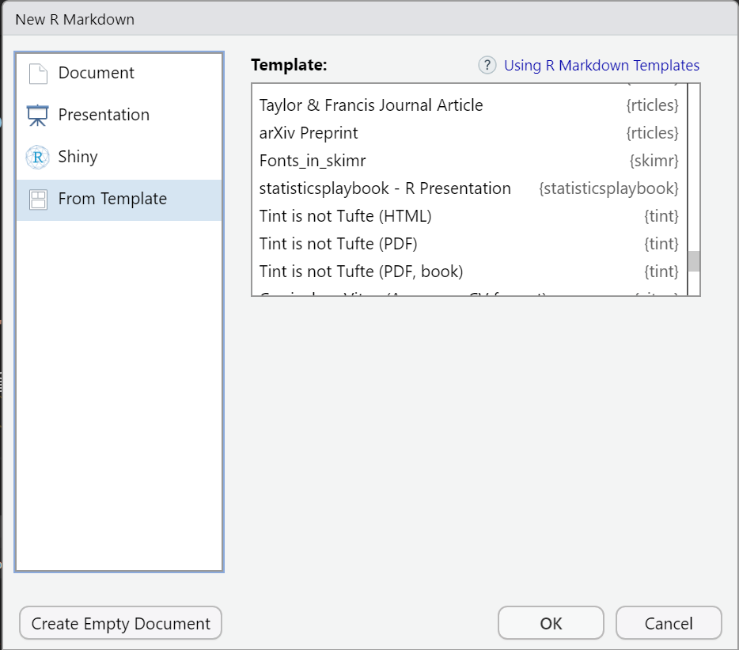

<!-- README.md is generated from README.Rmd. Please edit that file -->

```{r, include = FALSE}
knitr::opts_chunk$set(
  collapse = TRUE,
  comment = "#>",
  fig.path = "man/figures/README",
  fig.height = 3,
  fig.width = 5
)
```

# 슬기로운 통계생활 테마 <a href='https://nhsrcommunity.com/'></a>

[슬기로운 통계생활](https://www.youtube.com/c/statisticsplaybook) 테마를 ggplot과 xaringan에 적용하기 쉽도록 고안된 패키지 입니다.

# 설치 방법

```{r eval=FALSE}
# install.packages('devtools')
devtools::install_github('statisticsplaybook/statisticsplaybook')
```

# 사용 방법

```{r eval=FALSE}
library(statisticsplaybook)
```

## R 프리젠테이션 Template

1. Rmd 파일은 생성

`File > New File > Rmarkdown...`

2. 템플릿으로부터 생성을 선택 후 `statisticsplaybook -  R presentation`을 선택함.


